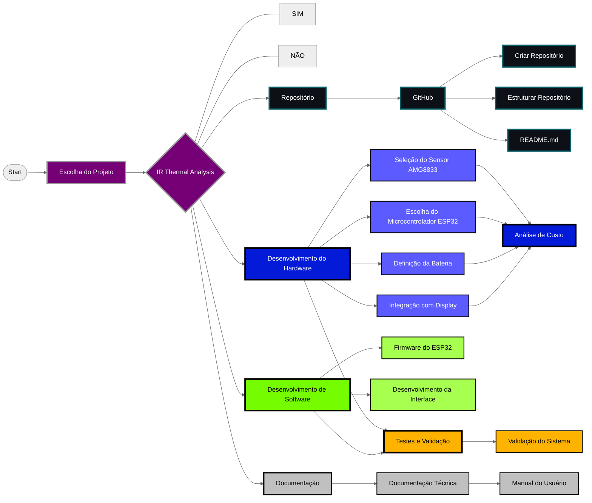

```mermaid
%%{init: {'theme': 'neutral'}}%%

flowchart LR

                    %% Estruturar o Projeto %%

start(["Start"]) --> def_projeto["Escolha do Projeto"]
def_projeto --> ir_thermalAnalysis_y{"IR Thermal Analysis"}
ir_thermalAnalysis_y --- ir_thermalAnalysis["SIM"]
ir_thermalAnalysis_y --- ir_thermalAnalysis_n["NÃO"]

style def_projeto fill:#750075,color:#ffffff,stroke-width: 3px,stroke:
style ir_thermalAnalysis_y fill:#750075,color:#ffffff,stroke-width: 3px,stroke:
                    %% Repositório


repo["Repositório"]
style repo fill:#0d1117,color:#ffffff,stroke-width: 3px,stroke:#086167;

ir_thermalAnalysis_y --> repo

github["GitHub"]
style github fill:#0d1117,color:#ffffff,stroke-width: 3px,stroke:#086167;

repo_criar["Criar Repositório"]
style repo_criar fill:#0d1117,color:#ffffff,stroke-width: 3px,stroke:#086167;

repo_estruturar["Estruturar Repositório"]
style repo_estruturar fill:#0d1117,color:#ffffff,stroke-width: 3px,stroke:#086167;

repo_readme["README.md"]
style repo_readme fill:#0d1117,color:#ffffff,stroke-width: 3px,stroke:#086167;

repo --> github
github --> repo_criar
github --> repo_estruturar
github --> repo_readme

                    %% Desenvolvimento do Hardware %%


hardware["Desenvolvimento do Hardware"]
style hardware fill:#041ad9,color:#ffffff,stroke-width: 4px,stroke:#000000;

ir_thermalAnalysis_y --> hardware

hardware --> sensor["Seleção do Sensor AMG8833"]
style sensor fill:#5b5bff,color:#ffffff,stroke-width: 2px,stroke:#000000;

hardware --> mcu["Escolha do Microcontrolador ESP32"]
style mcu fill:#5b5bff,color:#ffffff,stroke-width: 2px,stroke:#000000;

hardware --> bateria["Definição da Bateria"]
style bateria fill:#5b5bff,color:#ffffff,stroke-width: 2px,stroke:#000000;

hardware --> display["Integração com Display"]
style display fill:#5b5bff,color:#ffffff,stroke-width: 2px,stroke:#000000;


                    %% Análise de Custo %%

custo["Análise de Custo"]
style custo fill:#041ad9,color:#ffffff,stroke-width: 4px,stroke:#000000;

sensor --> custo
mcu --> custo
bateria --> custo
display --> custo


                    %% Desenvolvimento de Software %%

software["Desenvolvimento de Software"]
style software fill:#76fc00,color:#000000,stroke-width: 4px,stroke:#000000;

ir_thermalAnalysis_y --> software

software --> firmware["Firmware do ESP32"]
style firmware fill:#a7ff4f,color:#000000,stroke-width: 2px,stroke:#000000;

software --> interface["Desenvolvimento da Interface"]
style interface fill:#a7ff4f,color:#000000,stroke-width: 2px,stroke:#000000;


                    %% Testes e Validação %%

testes["Testes e Validação"]
style testes fill:#feb301,color:#000000,stroke-width: 4px,stroke:#000000;

hardware --> testes
software --> testes

testes --> validacao["Validação do Sistema"]
style validacao fill:#feb301,color:#000000,stroke-width: 2px,stroke:#000000;

                    %% Documentação


doc["Documentação"] 
ir_thermalAnalysis_y --> doc
style doc fill:#c0c0c0,color:#000000,stroke-width: 3px,stroke:#000000;

doc --> docs_tecnicas["Documentação Técnica"]
style docs_tecnicas fill:#c0c0c0,color:#000000,stroke-width: 2px,stroke:#000000;

docs_tecnicas --> manual["Manual do Usuário"]
style manual fill:#c0c0c0,color:#000000,stroke-width: 2px,stroke:#000000;

```