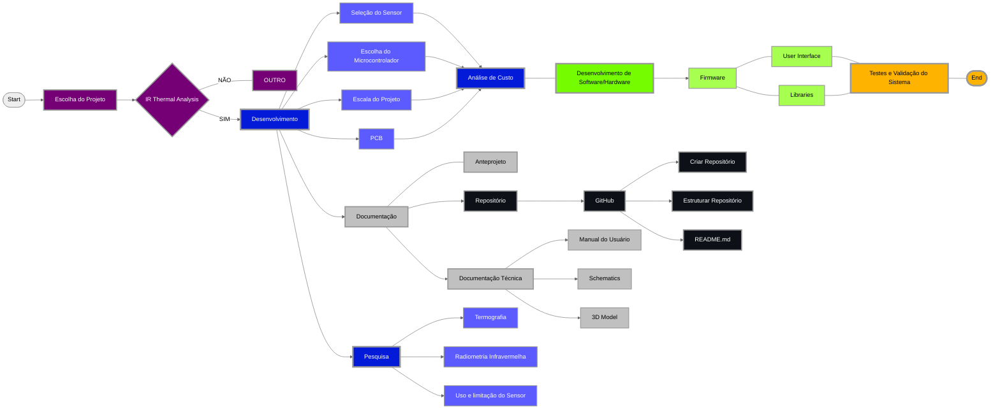

```mermaid

%%{init: {'theme': 'neutral'}}%%
flowchart LR

    %% Nós Principais
    start(["Start"]) --> escolhaProjeto["Escolha do Projeto"]
    escolhaProjeto --> analiseTermicaIr{"IR Thermal Analysis"}
    analiseTermicaIr ---|"NÃO"| outroProjeto["OUTRO"]
    analiseTermicaIr -->|"SIM"| desenvolvimentoHw["Desenvolvimento"]
    desenvolvimentoHw --> selecaoSensor["Seleção do Sensor "]
    desenvolvimentoHw --> escolhaMcu["Escolha do Microcontrolador "]
    desenvolvimentoHw --> definicaoEscala["Escala do Projeto"]
    desenvolvimentoHw --> pcbDesign["PCB"]
    desenvolvimentoHw --> documentacaoHw["Documentação"]
    documentacaoHw --- anteprojeto["Anteprojeto\n"]
    documentacaoHw --> repositorio
    desenvolvimentoHw --> pesquisa["Pesquisa"]
    pesquisa --> termografia["Termografia"]
    pesquisa --> radiometriaIr["Radiometria Infravermelha"]
    pesquisa --> limitacaoSensor["Uso e limitação do Sensor\n"]
    
    %% Análise de Custo
    selecaoSensor --> analiseCusto["Análise de Custo"]
    escolhaMcu --> analiseCusto
    definicaoEscala --> analiseCusto
    pcbDesign --> analiseCusto
    analiseCusto --- desenvolvimentoSw["Desenvolvimento de Software/Hardware"]
    
    %% Desenvolvimento de Software/Hardware
    desenvolvimentoSw --> firmware["Firmware"]
    firmware --- interfaceUsuario["User Interface"]
    firmware --- bibliotecas["Libraries"]
    interfaceUsuario --- testesValidacao["Testes e Validação do Sistema\n"]
    bibliotecas --- testesValidacao
    testesValidacao --- fim(["End\n"])
    
    %% Documentação Técnica
    documentacaoHw --> docTecnica["Documentação Técnica"]
    docTecnica --> manualUsuario["Manual do Usuário"]
    docTecnica --> esquematicos["Schematics"]
    docTecnica --> modelo3d["3D Model"]
    
    %% Repositório
    repositorio["Repositório"] --> github["GitHub"]
    github --> criarRepositorio["Criar Repositório"]
    github --> estruturarRepositorio["Estruturar Repositório"]
    github --> readme["README.md"]

    %% Estilos
    style escolhaProjeto fill:#750075,color:#ffffff,stroke-width:3px
    style analiseTermicaIr fill:#750075,color:#ffffff,stroke-width:3px
    style outroProjeto fill:#750075,color:#ffffff,stroke-width:3px
    style desenvolvimentoHw fill:#041ad9,color:#ffffff,stroke-width:4px
    style selecaoSensor fill:#5b5bff,color:#ffffff,stroke-width:2px
    style escolhaMcu fill:#5b5bff,color:#ffffff,stroke-width:2px
    style definicaoEscala fill:#5b5bff,color:#ffffff,stroke-width:2px
    style pcbDesign fill:#5b5bff,color:#ffffff,stroke-width:2px
    style analiseCusto fill:#041ad9,color:#ffffff,stroke-width:4px
    style desenvolvimentoSw fill:#76fc00,color:#000000,stroke-width:4px
    style firmware fill:#a7ff4f,color:#000000,stroke-width:2px
    style interfaceUsuario fill:#a7ff4f,color:#000000,stroke-width:2px
    style bibliotecas fill:#a7ff4f,color:#000000,stroke-width:2px
    style testesValidacao fill:#feb301,color:#000000,stroke-width:4px
    style fim fill:#feb301,color:#000000,stroke-width:4px
    style documentacaoHw fill:#c0c0c0,color:#000000,stroke-width:3px
    style anteprojeto fill:#c0c0c0,color:#000000,stroke-width:3px
    style docTecnica fill:#c0c0c0,color:#000000,stroke-width:3px
    style manualUsuario fill:#c0c0c0,color:#000000,stroke-width:2px
    style esquematicos fill:#c0c0c0,color:#000000,stroke-width:2px
    style modelo3d fill:#c0c0c0,color:#000000,stroke-width:2px
    style repositorio fill:#0d1117,color:#ffffff,stroke-width:3px
    style github fill:#0d1117,color:#ffffff,stroke-width:3px
    style criarRepositorio fill:#0d1117,color:#ffffff,stroke-width:3px
    style estruturarRepositorio fill:#0d1117,color:#ffffff,stroke-width:3px
    style readme fill:#0d1117,color:#ffffff,stroke-width:3px
    style pesquisa fill:#041ad9,color:#ffffff,stroke-width:4px
    style termografia fill:#5b5bff,color:#ffffff,stroke-width:2px
    style radiometriaIr fill:#5b5bff,color:#ffffff,stroke-width:2px
    style limitacaoSensor fill:#5b5bff,color:#ffffff,stroke-width:2px


```
